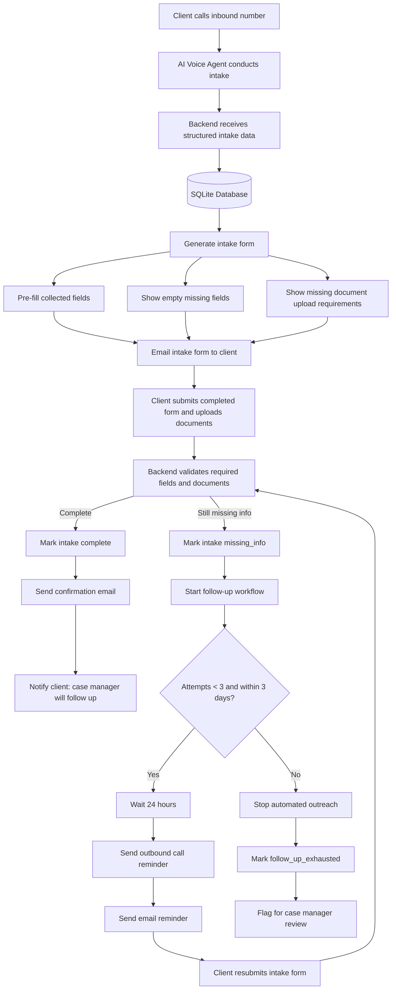
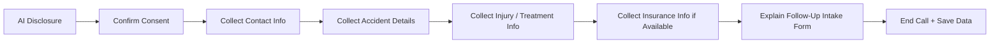

# MedVoice

MedVoice is a Vapi-powered AI voice intake agent that collects core personal-injury
intake information over the phone, stores it in a lightweight CRM/intake backend,
generates a **prefilled** client intake form, and emails the form link to the client
so they can complete the missing information.

> Setup, env, and step-by-step testing live in **[docs/medvoice-mvp.md](docs/medvoice-mvp.md)**.
> This README explains how the pieces connect.

## What MedVoice Does

- Handles AI intake calls through **Vapi** (inbound + outbound *test* calls — Vapi only, no Twilio).
- Collects the **highest-value** case information conversationally, one question at a time.
- Stores **clients, cases, calls, transcripts/summaries, and normalized intake fields**.
- Generates a **secure, prefilled** 5-step intake form (token-based link).
- **Emails** the form link to the client after the call (SendGrid, or dry-run logging).
- Supports a basic **reminder** email and **dry-run modes** for email and Vapi calls.

## Setup

> **Prompt management is config-as-code (industry standard).** The two Vapi prompts
> live in this repo as the single source of truth and are deployed to the Vapi
> assistant via the API with `npm run sync:assistant`. **Don't hand-edit the prompt in
> the Vapi dashboard** — it will drift from the repo and be overwritten on the next sync.

### Prerequisites
- Node.js ≥ 18, a [Vapi](https://dashboard.vapi.ai) account, and (for phone calls /
  saving call data) [`ngrok`](https://ngrok.com). Vapi provides the transcriber
  (Deepgram), model (OpenAI), and voice — no ElevenLabs/OpenAI/Deepgram keys in this repo.

### 1. Install & configure env
```bash
cd server && npm install && cp .env.example .env
cd ../frontend && npm install
```
Fill `server/.env` (from the Vapi dashboard → **API Keys / Assistants / Phone Numbers**):
| Var | Value |
|---|---|
| `VAPI_API_KEY` | **private** key (server-only) |
| `VAPI_PUBLIC_KEY` | **public** key (browser web-call test) |
| `VAPI_ASSISTANT_ID` | your assistant's id (or use `--create` in step 3) |
| `VAPI_PHONE_NUMBER_ID` | a number provisioned in Vapi |
| `VAPI_WEBHOOK_SECRET` | any random string (sync pushes it to Vapi for you) |
| `WEBHOOK_BASE_URL` | your ngrok https URL (step 4) |

### 2. The two Vapi prompts (in this repo)
These are the only two prompts the assistant needs. They're deployed by the sync
command in step 3 — or paste them into the dashboard manually as a one-time fallback.

**First Message** — [`prompts/vapi-mvp-inbound-first-message.md`](prompts/vapi-mvp-inbound-first-message.md):
```
Thanks for calling MedVoice. I'm an AI assistant for the intake team — I can take down a few basic details about your potential injury case so the team can follow up. Is now a good time to go through a few quick questions?
```

**System Prompt** — [`prompts/vapi-mvp-intake-agent.md`](prompts/vapi-mvp-intake-agent.md):
the full inbound intake prompt (identity, guardrails, the field-collection order, and
tool usage). Open the file for the canonical text. *(Opt-out is outbound-only — the
outbound opener + system prompt live in `prompts/vapi-mvp-opening-line.md` and
`prompts/vapi-mvp-outbound-test-agent.md`.)*

### 3. Create / sync the assistant
```bash
cd server
npm run sync:assistant -- --create   # first time → creates the assistant, prints its id (paste into .env)
npm run sync:assistant               # thereafter → deploys the prompt files to that assistant
```
In the dashboard, set **Transcriber: Deepgram · Model: OpenAI · Voice: built-in** (one-time).

### 4. Expose the server (for phone calls + dashboard data)
```bash
cd server && npm run dev          # terminal 1 → http://localhost:3001
ngrok http 3001                   # terminal 2 → copy the https URL into WEBHOOK_BASE_URL
npm run sync:assistant            # re-run so Vapi gets the webhook URL + tools + secret
cd ../frontend && npm run dev      # terminal 3 → http://localhost:3000
```

### 5. Bind the number for inbound (one-time, dashboard)
Vapi → **Phone Numbers → your number → Inbound Settings → Assistant** = your assistant.

### 6. Test & view
- **Web call:** http://localhost:3000/vapi → Start.
- **Phone call:** dial your Vapi number.
- **Results:** http://localhost:3000/dashboard (auto-refreshes after the call ends).

Full details and troubleshooting: [docs/medvoice-mvp.md](docs/medvoice-mvp.md).

## System Design



- **AI Voice Agent (Vapi)** — runs the call (Deepgram transcription, OpenAI model, voice) and saves intake data to the backend via tools + the end-of-call webhook.
- **Backend** (`server/`, Express/ESM) — persists intake data, generates the unified form, validates required fields/documents, sends email, and runs the follow-up workflow.
- **SQLite database** — the **source of truth** for local/dev (`server/data/medvoice.db`). JSON is only used for payloads/logging, never as the store. (Postgres is supported via `DATABASE_URL` for production.)
- **Intake form** (`frontend/app/intake/[token]/page.js`) — one unified, token-secured form: prefilled fields, empty missing fields, and document-upload requirements.
- **Follow-up workflow** — outbound call/email reminders, capped at 3 attempts over 3 days, 24h apart, never to opted-out clients.

## Intake Status Lifecycle

- `new` — intake started but not yet processed
- `in_progress` — voice agent is collecting information
- `form_sent` — intake form was generated and sent to the client
- `missing_info` — client submitted the form but required fields or documents are still missing
- `complete` — all required fields and documents are complete
- `follow_up_exhausted` — system attempted 3 follow-ups over 3 days and stopped automated outreach
- `case_manager_review` — intake needs human review or manual follow-up

## Call Intake Flow

The voice agent does **not** collect every field. It captures the highest-value
information first, then a prefilled form covers the rest. On the call it collects:
consent to continue, name, phone, email, accident type, accident date, accident
location, a short description of what happened, injury/treatment summary, ER/urgent
care status, police-report status, insurance/claim info (if handy), preferred
contact method, and primary language.



Prompts: `prompts/vapi-mvp-opening-line.md`, `prompts/vapi-mvp-intake-agent.md`,
`prompts/vapi-mvp-outbound-test-agent.md`.

## Intake Form Structure

A 5-step form. Step 4 is **conditional on accident type**.

1. **Patient** — client information; primary care provider
2. **Incident** — accident details; police report; witness/video info
3. **Treatment** — ER/urgent care; imaging; procedures; missed work/school; bills/claims
4. **Module** *(conditional)* — Premises Liability **or** Motor Vehicle Accident **or** Workplace Injury
5. **Coverage** — insurance information; attorney/paralegal assignment *(staff-only)*; notes

## Data Model Overview

- **Client** — basic contact info + language/contact preferences.
- **Case** — accident, injury, status, and case-level fields; holds the form token.
- **IntakeField** — normalized per-field value with `source`, `status`, `confidence`, and client-facing/staff-only flags.
- **Call** (`intakeCalls`) — Vapi call metadata: id, direction, transcript, summary, recording link.
- **EmailLog** — each form/reminder email attempt and its status.

## Field Source Tracking

Each intake field records where its value came from: `call`, `form`, `staff`, or
`outbound_call`. This lets the system show what the AI captured on the call vs. what
the client confirmed in the form, compute which required fields are still missing,
and keep prefilled values editable.

**Duplicate handling.** Clients are de-duped exactly by **phone (normalized) or
email** — the same caller (even with the number typed differently) updates the same
record. A returning caller with the **same name but a new number** can't be matched
exactly, so the case is **flagged `possibleDuplicate`** (linked to the other client)
for staff review on the dashboard — it is never auto-merged, since two people can
share a name.

**Dashboard.** `/dashboard` is a read-only staff view of every saved case: client,
status, captured fields (tagged by source), call transcripts/summaries, emails sent,
missing fields, and duplicate/human-follow-up flags. It auto-refreshes, so cases
appear right after a call ends.

## Vapi Integration (conceptual)

Vapi runs the voice agent and handles the phone call, then sends call data back to
the backend (`/api/vapi/events`, `/api/vapi/end-of-call`). The backend stores the
transcript, summary, and extracted fields, and can trigger outbound **test** calls
through Vapi (`/api/vapi/outbound-test-call`). Two optional tools
(`upsert-intake-fields`, `get-missing-fields`) let the agent save fields mid-call.
*(Configuration details are in [docs/medvoice-mvp.md](docs/medvoice-mvp.md).)*

**Prompt management (config-as-code).** The repo's `prompts/*.md` files are the
single source of truth. Deploy them to the persistent Vapi assistant via the API:
```bash
cd server && npm run sync:assistant         # PATCH the assistant from the prompt files
#            npm run sync:assistant -- --create   # first time: make a new assistant
```
Don't hand-edit the prompt in the dashboard (it would drift from the repo). The
`/vapi` web-call test page uses the **deployed assistant as-is** (no prompt override),
so it faithfully matches real phone calls. Opt-out disclosure is **outbound-only** —
the inbound intake prompt has no opt-out step.

## Email Flow

Three emails: (1) the **intake form link** after the call, (2) a **confirmation**
once all required fields + documents are complete, and (3) **missing-info reminders**
during the follow-up workflow (max 3, 24h apart, 3-day window). If `SENDGRID_API_KEY`
is missing or `DRY_RUN_EMAILS=true`, emails are logged instead of sent.

## Current MVP Scope (implemented)

- Vapi voice intake agent (prompts + inbound webhook handling)
- Vapi event / end-of-call processing
- CRM / intake field storage (local JSON dev store by default)
- Prefilled 5-step client intake form
- Emailing the form link (SendGrid or dry-run)
- Basic outbound Vapi test call + outbound opt-out / do-not-call handling
- Duplicate detection: exact de-dupe by phone/email + **possible-duplicate flag** by name (flagged for review, never auto-merged)
- Read-only **staff dashboard** (`/dashboard`) showing every case, fields by source, transcripts, emails, missing fields, and duplicate flags
- Simple reminder email endpoint
- Dry-run modes for email and Vapi calls
- 37 automated checks (`npm test`)

## ⚠️ Known Constraints (must change before production)

These are intentional MVP shortcuts — the app works locally today, but each of
these needs to change before any real/production use:

- **Storage is a local JSON dev store.** Postgres scaffolding exists behind a
  repository (`server/src/mvp/repo.js`, set `DATABASE_URL`) but is unused by default
  and unverified against a live DB. **Future:** run on a managed Postgres (or at
  least SQLite locally); migrate the legacy CRM collections and the opt-out store
  onto the same DB so nothing lives in the JSON file.
- **No telephony provider integrated.** Calls go through Vapi only. **Future:**
  **Twilio integration** (import/port a real number, SMS reminders) — none of the
  Twilio path exists yet.
- **Opt-out store lives in the JSON CRM layer**, not the MVP DB. **Future:** move it
  onto the repo/Postgres path when storage is migrated.
- **Email/calls default to dry-run** and the Vapi assistant is configured by hand in
  the dashboard (not provisioned by code).
- **No auth, rate limiting, or audit logging**; single-process only.

## Future Scope (planned, not implemented)

- **Move storage to a managed database (Postgres)** — see Constraints above
- **Twilio integration** — real number import/porting + SMS reminders
- MCP tool layer
- Admin CRM dashboard
- Automated reminder scheduling (no scheduler today)
- Production auth / roles, rate limiting, audit logging
- Human-handoff workflow *(the call sets a `humanFollowUpNeeded` flag today, but there's no downstream workflow)*
- Deeper analytics / call scoring *(a heuristic post-call analyzer exists from an earlier layer; not wired into the MVP flow)*
- Compliance review (TCPA, recording-consent retention, PII handling)

> Note: the repo also contains an **earlier CRM-tools layer** (`/tools/*`,
> `server/src/crm/`) and Vapi capability research (`docs/vapi-capability-research.md`,
> `docs/mvp-scope.md`) from prior iterations. The MedVoice MVP described here is the
> current focus.

## Important Design Principle

MedVoice is intentionally split into two stages:

1. The **voice call** collects high-signal intake information quickly.
2. The **intake form** completes the remaining structured fields.

This keeps the phone call short while still giving the CRM a complete intake record.
