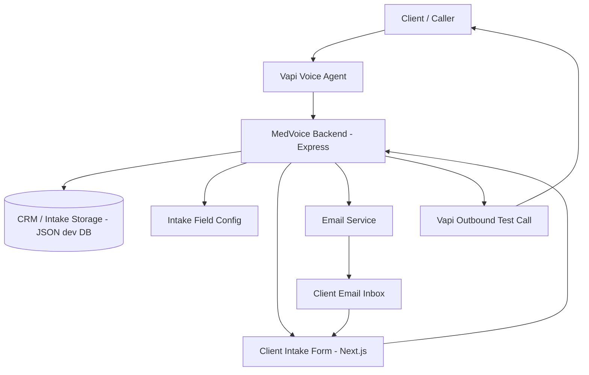
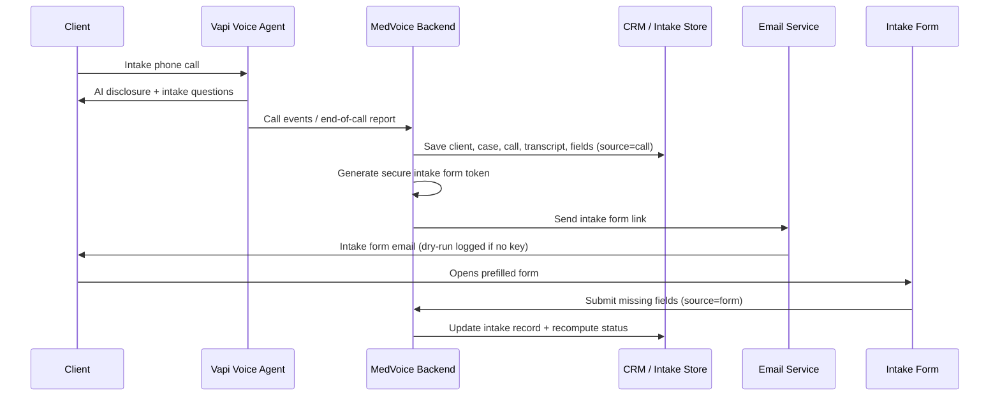
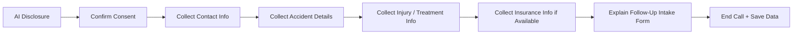
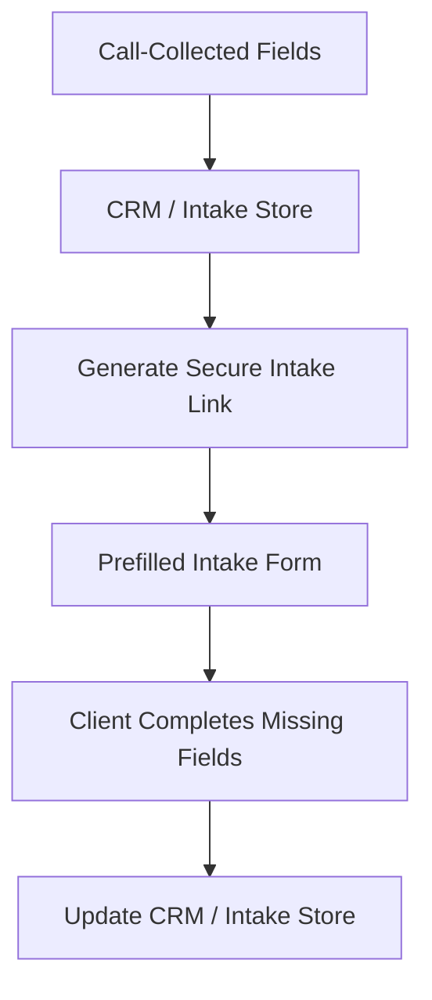
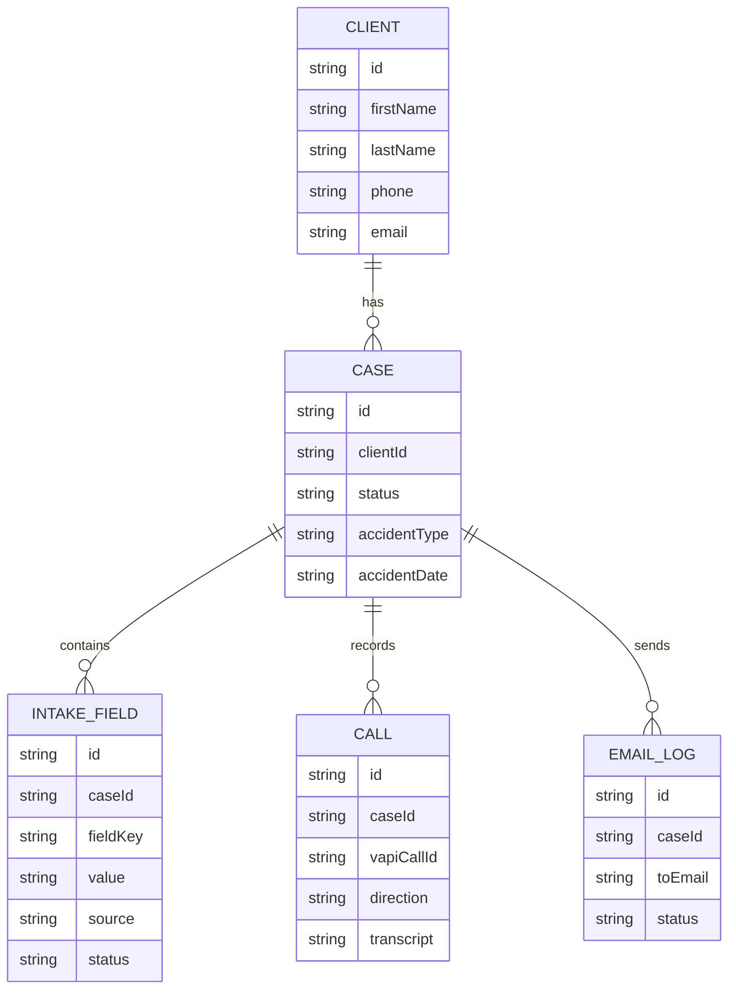
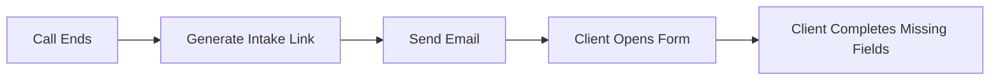

# MedVoice

MedVoice is a Vapi-powered AI voice intake agent that collects core personal-injury
intake information over the phone, stores it in a lightweight CRM/intake backend,
generates a **prefilled** client intake form, and emails the form link to the client
so they can complete the missing information.

> Setup, env, and step-by-step testing live in **[docs/medvoice-mvp.md](docs/medvoice-mvp.md)**.
> This README explains how the pieces connect.

## What MedVoice Does

- Handles AI intake calls through **Vapi** (inbound + outbound *test* calls — Vapi only, no Twilio).
- Collects the **highest-value** case information conversationally, one question at a time.
- Stores **clients, cases, calls, transcripts/summaries, and normalized intake fields**.
- Generates a **secure, prefilled** 5-step intake form (token-based link).
- **Emails** the form link to the client after the call (SendGrid, or dry-run logging).
- Supports a basic **reminder** email and **dry-run modes** for email and Vapi calls.

## System Overview

- **Vapi Voice Agent** — runs the conversation: telephony, transcription (Deepgram), model (OpenAI), and the voice. Calls the backend via webhooks/tools.
- **MedVoice Backend** (`server/`, Express/ESM) — receives Vapi events, runs the intake services, serves the form API, sends email, and triggers outbound test calls.
- **CRM / Intake Storage** — a JSON file dev DB (`server/src/db/mockDb.js`); collections for clients, cases, intakeFields, intakeCalls, emailLogs. *(A real database is future scope — `DATABASE_URL` is a placeholder.)*
- **Intake Field Config** (`server/src/config/intakeFields.js`) — single source of truth for the 5-step form, what the call prioritizes, and required/conditional/staff-only/sensitive rules.
- **Client Intake Form** (`frontend/app/intake/[token]/page.js`) — the prefilled, token-secured 5-step form.
- **Email Service** (`server/src/mvp/emailService.js`) — SendGrid via REST, or dry-run.
- **Outbound Vapi Call** (`server/src/mvp/vapiService.js`) — places a Vapi test call (dry-run by default).

## End-to-End Flow

## Call Intake Flow

The voice agent does **not** collect every field. It captures the highest-value
information first, then a prefilled form covers the rest. On the call it collects:
consent to continue, name, phone, email, accident type, accident date, accident
location, a short description of what happened, injury/treatment summary, ER/urgent
care status, police-report status, insurance/claim info (if handy), preferred
contact method, and primary language.

Prompts: `prompts/vapi-mvp-opening-line.md`, `prompts/vapi-mvp-intake-agent.md`,
`prompts/vapi-mvp-outbound-test-agent.md`.

## Intake Form Flow

The form is generated after the call, prefilled from call-collected data. The client
completes what's missing; submissions update the same case record. Staff-only fields
are hidden, and the conditional Step 4 module is chosen by accident type.

## Intake Form Structure

A 5-step form. Step 4 is **conditional on accident type**.

1. **Patient** — client information; primary care provider
2. **Incident** — accident details; police report; witness/video info
3. **Treatment** — ER/urgent care; imaging; procedures; missed work/school; bills/claims
4. **Module** *(conditional)* — Premises Liability **or** Motor Vehicle Accident **or** Workplace Injury
5. **Coverage** — insurance information; attorney/paralegal assignment *(staff-only)*; notes

## Data Model Overview

- **Client** — basic contact info + language/contact preferences.
- **Case** — accident, injury, status, and case-level fields; holds the form token.
- **IntakeField** — normalized per-field value with `source`, `status`, `confidence`, and client-facing/staff-only flags.
- **Call** (`intakeCalls`) — Vapi call metadata: id, direction, transcript, summary, recording link.
- **EmailLog** — each form/reminder email attempt and its status.

## Field Source Tracking

Each intake field records where its value came from: `call`, `form`, `staff`, or
`outbound_call`. This lets the system show what the AI captured on the call vs. what
the client confirmed in the form, compute which required fields are still missing,
and keep prefilled values editable.

## Vapi Integration (conceptual)

Vapi runs the voice agent and handles the phone call, then sends call data back to
the backend (`/api/vapi/events`, `/api/vapi/end-of-call`). The backend stores the
transcript, summary, and extracted fields, and can trigger outbound **test** calls
through Vapi (`/api/vapi/outbound-test-call`). Two optional tools
(`upsert-intake-fields`, `get-missing-fields`) let the agent save fields mid-call.
*(Configuration details are in [docs/medvoice-mvp.md](docs/medvoice-mvp.md).)*

## Email Flow

If `SENDGRID_API_KEY` is missing or `DRY_RUN_EMAILS=true`, the app logs the email
instead of sending it and records an `EmailLog`. Reminders are basic in this MVP
(`POST /api/intake/send-reminder`) — no automated schedule.

## Current MVP Scope (implemented)

- Vapi voice intake agent (prompts + inbound webhook handling)
- Vapi event / end-of-call processing
- CRM / intake field storage (JSON dev DB)
- Prefilled 5-step client intake form
- Emailing the form link (SendGrid or dry-run)
- Basic outbound Vapi test call
- Simple reminder email endpoint
- Dry-run modes for email and Vapi calls
- 28 automated checks (`npm test`)

## Future Scope (planned, not implemented)

- Twilio / SMS reminders
- MCP tool layer
- Admin CRM dashboard
- Automated reminder scheduling
- Production auth / roles
- Human-handoff workflow *(the call sets a `humanFollowUpNeeded` flag today, but there's no downstream workflow)*
- Deeper analytics / call scoring *(a heuristic post-call analyzer exists from an earlier layer; not wired into the MVP flow)*
- Compliance review and audit logging
- Real database behind `DATABASE_URL`

> Note: the repo also contains an **earlier CRM-tools layer** (`/tools/*`,
> `server/src/crm/`) and Vapi capability research (`docs/vapi-capability-research.md`,
> `docs/mvp-scope.md`) from prior iterations. The MedVoice MVP described here is the
> current focus.

## Important Design Principle

MedVoice is intentionally split into two stages:

1. The **voice call** collects high-signal intake information quickly.
2. The **intake form** completes the remaining structured fields.

This keeps the phone call short while still giving the CRM a complete intake record.
